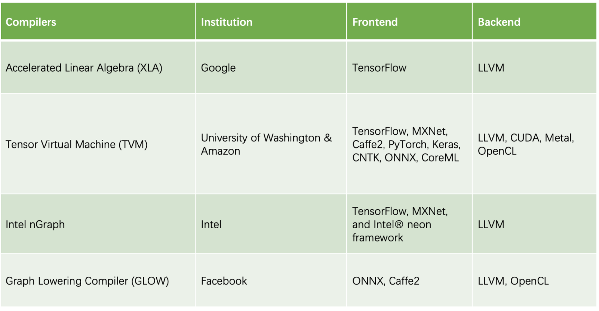
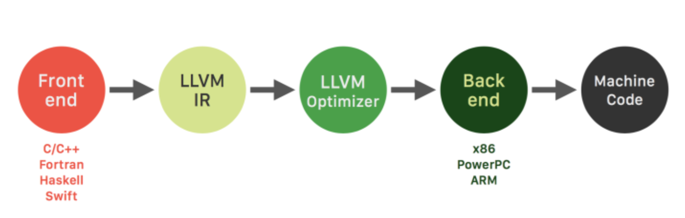

# Deep Learning Compiler
## What is Deep Learning Compiler

Deep Learning Compiler compiles the high-level abstract representations of ML models to generate code for different accelerators, where multiple optimization techniques are applied to emit efficiency and high performance code for each architecture.

## Existing deep learning compilers

Detailed introductions are as follows

## LLVM

### What is LLVM

*大量不同的编程语言和越来越多的硬件架构之间需要一个桥梁*

* The LLVM compiler infrastructure project is a “collection of *modular* and *reusable compiler* and *toolchain technologies*”[3] that can be used to develop a front end for any programming language and a back end for any instruction set architecture
* LLVM is written in C++ and is designed for compile-time, link-time, run-time, and “idle-time” optimization

### LLVM IR

LLVM is designed around a **language-independent intermediate representation (LLVM IR)** that serves as a portable, high-level assembly language that can be optimized with a variety of transformations over multiple passes.

## ONNX

* The Open Neural Network Exchange Format (ONNX) is a new standard *format* for exchanging deep learning *models*.
* Make deep learning models portable thus preventing vendor lock in
* Created by Facebook and Microsoft

#### Use case

* train a model with one tool stack and then deploy it using another for  inference and prediction

#### Technical Design

> ONNX provides a definition of an extensible computation graph model, as well as definitions of built-in operators and standard data types.
> Each computation data flow graph is structured as _a list of nodes that form an acyclic graph_. Nodes have one or more inputs and one or more outputs. Each node is a call to an operator. The graph also has metadata to help document its purpose, author, etc.
> Operators are implemented externally to the graph, but the set of built-in operators are portable across frameworks. Every framework supporting ONNX will provide implementations of these operators on the applicable data types.
> More details can be found on the [GitHub site](https://github.com/onnx/onnx) 

#### Support

* PyTorch, CNTK, MXNet, Caffe2
* Converters for TensorFlow and CoreML

#### Reference

 [What every ML/AI developer should know aboutONNX](https://blog.paperspace.com/what-every-ml-ai-developer-should-know-about-onnx/)  25 MARCH 2018

[ONNX official website](https://onnx.ai/about) 

## AutoTVM (demo) 2019-SysML

### What is AutoTVM

AutoTVM aims to show an automated end-to-end solution for optimizing and deploying deep learning models on edge hardware, specially single-board-computer and mobile phone form-factor devices.

### Features

1. extract operator requirements automatically from a neural network computation graph
2. leverage a machine learning guided optimizer to tune operator implementations for performance on real hardware
3. produce executable libraries customized to the specific hardware platform and model architecture, without laborious manual effort

### TVM language

 TVM language allows us to programmatically define a rich search space of implementation options analogous to what a human engineer can explore manually. 