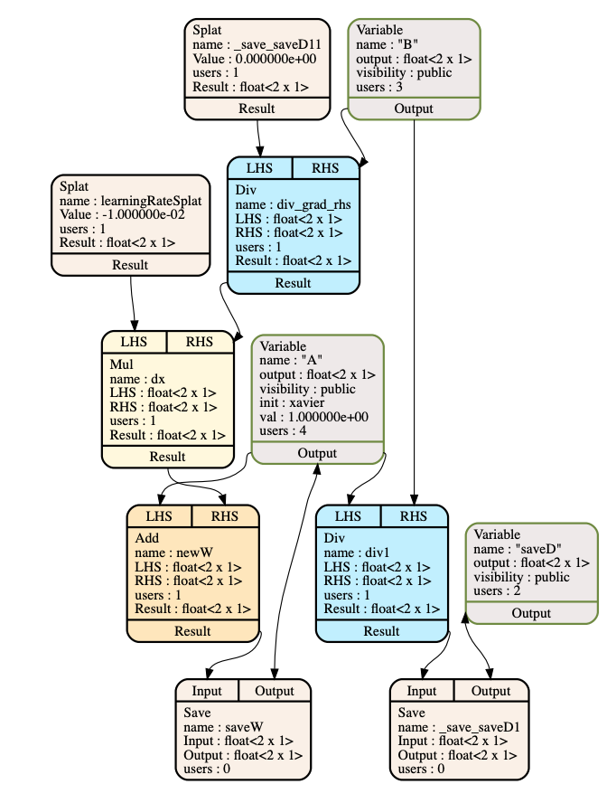
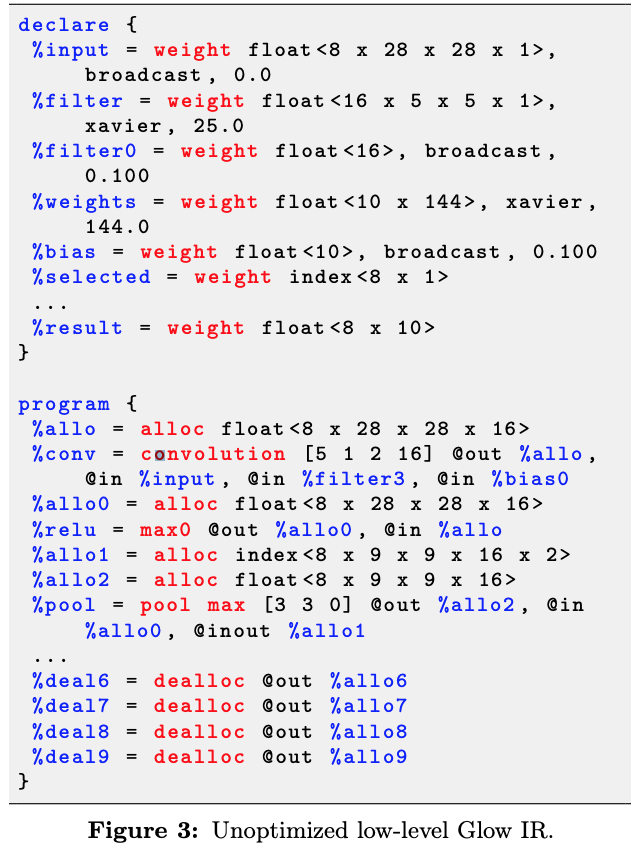
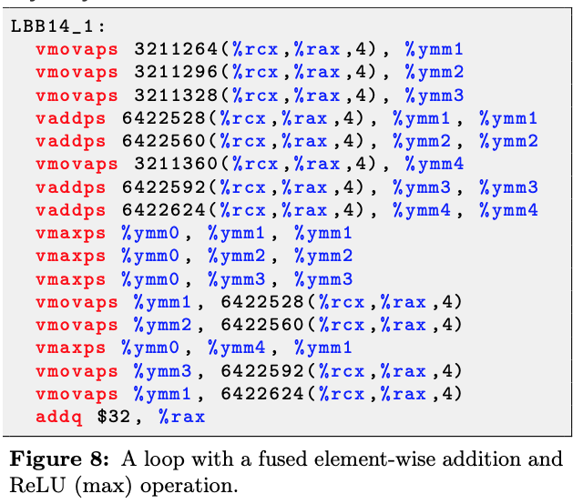
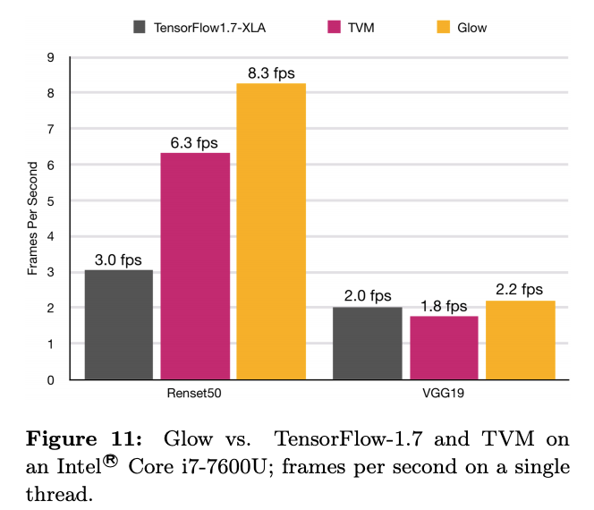

# Glow - 2019 C4ML
## What is Glow
* A machine learning compiler for heterogeneous hardware, which enables the generation of highly optimized code for multiple targets

## Features
* Developed by _Facebook_
* Lowers the traditional neural network data-flow into a *two-phase strongly-typed* *intermediate representation* (IR)
* Glow is designed to consume a neural network compute graph, optimize it, and code generate for it for a diverse set of backends in a more scalable way

## Frontend and Backend
* Frontend: ONNX, Caffe2
* Backend: LLVM, OpenCL

## High level IR
* The high-level IR is a simple graph that allows basic transformations such as replacing all uses of some node with another node and modifying the content of variables.
* Strongly typed
* Structured as a module that contains multiple functions that contain multiple nodes
* Has a _debug method_ for duping textual and graphical representations of the graph
* Optimization: optimize the graph with *target-independent* optimizations and lowering from high-level operator nodes to linear algebra operator nodes.
	1. Variable visibility: annotated with public or private labels, where optimizer is allowed to delete unused private variables, transpose, perform constant propagation, etc.
	2. prediction: control the execution of some node or instruction by means of a boolean flag 
	3. **Node lowering** :breaks the high-level operator nodes into low-level linear algebra operator nodes -- e.g., fully connected layer -> matrix multiplication and broadcasted add.

## Low-level IR
* Further lowered into the low-level IR in a phase called *IRGen*(IR generation)
* *One-to-many translation* where each high-level node is translated into one or more *instructions* 
* The lower-level instruction-based address-only IR allows the compiler to perform memory-related *optimizations*
	1. Hiding the latency: hides the latency of memory operations by overlapping fetching and executing instructions.
	2. Asynchronous DMA operations

## Work flow
1. The graph is either loaded via the graph loader (from _ONNX or Caffe2_ format), or constructed via the C++ interface. -> *graph*
2. The graph is differentiated if needed. -> *High-level IR*
3. The graph is optimized.  -> *High-level IR*
4. Linear algebra _node lowering_ takes place. -> *High-level IR*

5. Additional rounds of optimizations occur, both target independent and target specific. -> *High-level IR*
6. The graph is scheduled into a linear sequence of nodes that minimizes memory usage. -> *High-level IR*
7.  IRGen converts the low-level graph into instructions. -> *Low-level IR*

8. Low-level IR optimizations are performed. -> *Low-level IR*
9. Backend-specific optimizations and code generation are performed. -> *Low-level IR*
10. code generation: nodes for the high-level IR and instructions for the low-level IR. *-> execute code or object file*

## Evaluation
* compare Glow with XLA  and TVM
* Up to 2.7x faster than XLA: 
	* TensorFlow calls into Eigen which implements convolution using the classic im2col followed by matrix multiplication, while Glow compiles direct convolution and thus avoids im2col overhead
	* Glow performs shape-aware code-generation
* Up to 1.3x faster than TVM:
	* Not use auto-tuning and improved schedules with TVM

#