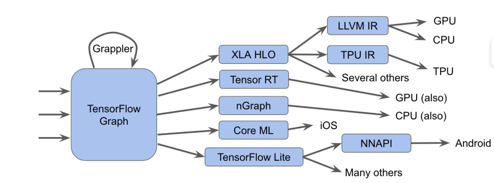

# MLIR （**M**ulti-**L**evel **I**ntermediate **R**epresentation）

[MLIR: A new intermediate representation and compiler framework](https://medium.com/tensorflow/mlir-a-new-intermediate-representation-and-compiler-framework-beba999ed18d) 20190409



## What is MLIR?

* This is a <u>representation format and library of compiler utilities</u> that sits between the model representation and low-level compilers/executors that generate <u>hardware-specific code</u>
* MLIR is, at its heart, a flexible infrastructure for modern optimizing compilers. 
* This means it consists of **1)** a specification for intermediate representations (IR) and **2)** a code toolkit to perform transformations on that representation. 


### Frontends and Backends

* Fontend: 
  * TensorFlow Graph — <u>TensorFlow IR</u>, which represents all things possible in TensorFlow graphs; XLA <u>HLO IR</u>, which is designed to take advantage of XLA’s compilation abilities (with output to, among other things, TPUs)
  * TF Lite representation. TensorFlow Lite will translate to running code on mobile platforms
* Backends: 
  * An experimental affine dialect, which focuses on [polyhedral representations](https://en.wikipedia.org/wiki/Polytope_model) and optimizations
  * LLVM IR, which has a 1:1 mapping between it and LLVM’s own representation, allowing MLIR to emit GPU and CPU code through LLVM


## [Multi-Level Intermediate Representation Overview](https://github.com/tensorflow/mlir)

* Ability to host high-performance-computing-style loop optimizations across kernels (fusion, loop interchange, tiling, etc) and to transform memory layouts of data.
* We do not try to support <u>low level machine code generation algorithms</u> (like register allocation and <u>instruction scheduling</u>). They are a better fit for lower level optimizers (such as LLVM)


### SSA

MLIR is an [SSA-based](https://en.wikipedia.org/wiki/Static_single_assignment_form) IR, which means that values are defined before use and have scope defined by their dominance relations.


# [MLIR Rationale](https://github.com/tensorflow/mlir/blob/master/g3doc/Rationale.md)

#### Main topic

* Mainly focus on the decisions made by MILR when adding a new language to it, including type, symbol, operations, regions, syntax, 
* Not about the optimization part.

#### Compared to Polly

* MLIR is able to represent arbitrary control flow and arbitrary data accesses and is general enough to represent nearly all sequential computation. 
*  [Polly](https://polly.llvm.org/): that are able to use the polyhedral abstraction in a way isolated from the LLVM IR and only for affine loop nests
* Statically unpredictable data accesses or control flow only limits to a certain extent the ability to reason about and apply transformations using the polyhedral abstraction. (other methods)

#### High-level transformations

* on loop nests: loop tiling, interchange, permutation, skewing, scaling, relative shifting, reversal, fusion, and distribution/fission. 
* on data layout: padding and transforming to blocked layouts

#### Low-level scheduling and mapping decisions

* mapping to specialized vector instructions, auto-vectorization, and software pipelining. 


## [Toy Tutorial Introduction](https://github.com/tensorflow/mlir/blob/master/g3doc/Tutorials/Toy/Ch-1.md)

#### Adding to IR

MLIR allows you to compose transformations at every level, and you can even define your own operations and abstractions in the IR $\Rightarrow$ In this way, MLIR is more of a pure compiler *infrastructure* than LLVM.(**WHY**)

#### What to compiler a new language

1. Abstract the AST of this language
2. Define and registering a dialect in MLIR

#### MILR stack

* target language -> [custom MLIR -> High-level dialects -> low-level dialects] -> LLVM IR


## [MLIR: The case for a *simplified* polyhedral form](https://github.com/tensorflow/mlir/blob/master/g3doc/RationaleSimplifiedPolyhedralForm.md)

### 1. Context: Traditional Polyhedral Form -> good for transformation

consider C-like code as follows

```
void simple_example(...) {
    for (int i = 0; i < N; ++i) {
      for (int j = 0; j < N; ++j) {
         float tmp = X[i,j]    // S1
         A[i,j] = tmp + 1      // S2
         B[i,j] = tmp * 42     // S3
       }
    }
  }
```

#### 1.1 A classical polyhedral representation form

```
mlfunc @simple_example(... %N) {
    %tmp = call @S1(%X, %i, %j)
      domain: (0 <= %i < %N), (0 <= %j < %N)
      schedule: (i, j, 0)

    call @S2(%tmp, %A, %i, %j)
      domain: (0 <= %i < %N), (0 <= %j < %N)
      schedule: (i, j, 1)

    call @S3(%tmp, %B, %i, %j)
      domain: (0 <= %i < %N), (0 <= %j < %N)
      schedule: (i, j, 2)
  }
```

#### 1.2  A more explicit schedule tree representation

A more explicit <u>schedule tree</u> representation

* exposes important <u>structure</u> that will make analyses and optimizations more efficient
* make the scoping of SSA values more explicit

```
mlfunc @simple_example(... %N) {
    d0/d1 = mlspace
    for S1(d0), S2(d0), S3(d0) {
      for S1(d1), S2(d1), S3(d1) {

        %tmp = call @S1(%X, d0, d1)      ;; S1
          domain: (0 <= d0 < %N), (0 <= d1 < %N)

        call @S2(%tmp, %A, d0, d1)      ;; S2
          domain: (0 <= d0 < %N), (0 <= d1 < %N)

        call @S3(%tmp, %B, d0, d1)      ;; S3
          domain: (0 <= d0 < %N), (0 <= d1 < %N)
      }
    }
  }
```

#### 1.3 The ability for instructions within a loop nest to have non-equal domains,

```
  mlfunc @reduced_domain_example(... %N) {
    d0/d1 = mlspace
    for S1(d0), S2(d0) {
      for S1(d1), S2(d1) {
        %tmp = call @S1(%X, d0, d1)    ;; S1
          domain: (0 <= d0 < %N), (0 <= d1 < %N)

        call @S2(%tmp, %A, d0, d1)      ;; S2
          domain: (10 <= d0 < %N-10), (10 <= d1 < %N-10)
      }
    }
  }
```

### 2. Proposal: Simplified Polyhedral Form -> good for code generation/analysis

Moving all of the domain and schedule information into the "schedule tree".
```
  mlfunc @simple_example(... %N) {
    affine.for %i = 0 ... %N step 1 {
      affine.for %j = 0 ... %N step 1 {
        // identity noop in this case, but can exist in general.
        %0,%1 = affine.apply #57(%i, %j)

        %tmp = call @S1(%X, %0, %1)

        call @S2(%tmp, %A, %0, %1)

        call @S3(%tmp, %B, %0, %1)
      }
    }
  }
```