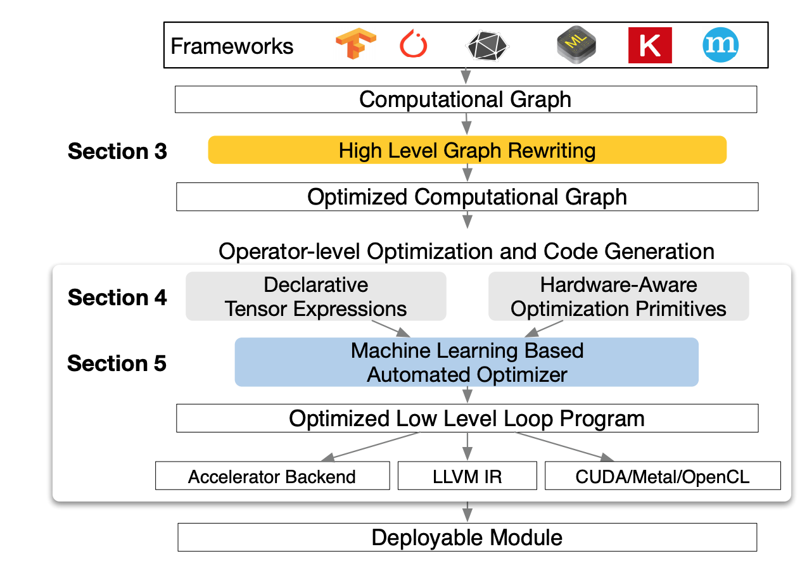
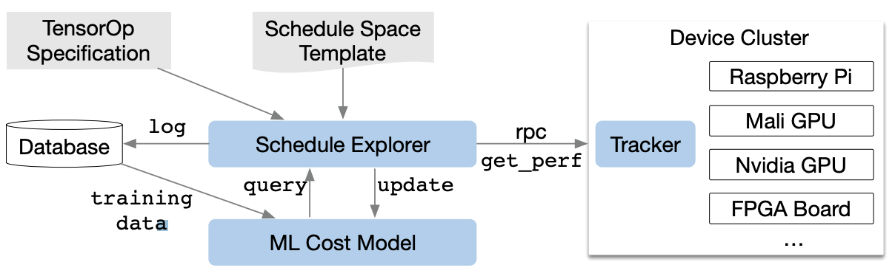
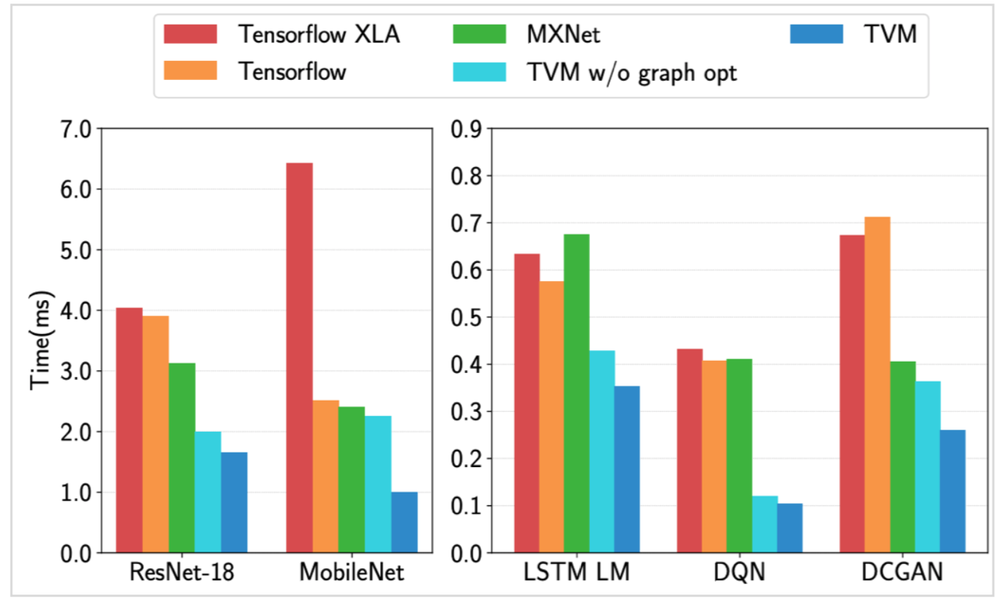

# TVM - 2018 OSDI & SysMl & 2019C4ML



## What is TVM

* A compiler that expose *graph-level* and *operator-level* optimizations to provide performance portability to deep learning workloads across diverse hardware back-ends

## Frontend and Backend
* Frontend：TensorFlow, MXNet, Caffe2, PyTorch, Keras, CNTK, ONNX, CoreML
* Backend：CPUs, server GPUs, mobile GPUs, and FPGA-based accelerators LLVM, CUDA, Metal, OpenCL

## Three modules
1. *tensor expression language*  build operators and provide program transformation primitives that generate different versions of the program with various optimizations
2. *automated program optimization framework*  ML-based cost model used to automatically explore and search for optimized tensor operators
3. *graph rewriter* that takes full advantage of high- and operator- optimizations

## Graph-level optimizations
1. *operator fusion*, which fuses multiple small operations together; 
2. *constant-folding*, which pre-computes graph parts that can be determined statically, saving execution costs; 
3. a *static memory planning pass*, which pre-allocates memory to hold each intermediate tensor; 
4. and *data layout transformations*, which transform internal data layouts into back-end-friendly forms

## Operator-level optimization
* *Tensorization*: transform instructions to  *tensor compute primitives*
	* make tensorization extensible by separating the target hardware intrinsic from the schedule with a mechanism for tensor-intrinsic declaration.
	* use the same tensor expression language to declare both the behavior of each new _hardware intrinsic_ and the _lowering rule_ associated with it
* *Explicit Memory Latency Hiding*
* *Automating schedule Optimizer*: from _tensor expression_ to _low-level code_

	* Two components: a *schedule explorer* that proposes promising new configurations, and a *machine learning cost model* that predicts the performance of a given configuration.
	* The ML model is updated periodically using collected data recorded in a database
	* *Input and output*: takes the lowered loop program (configuration) as input and predict its running time on a given hardware back-end
	* _How to choose the optimal configuration_: Given the cost model, run a parallel simulated annealing algorithm, start with random configurations, and at each step, randomly walks to a nearby configuration
	* TVM’s RPC: TVM implements a _customized, RPC-based distributed device pool_ that enables clients to run programs on a specific type of device: compile a program on the host compiler -> request a remote device -> run the function remotely -> access results in the same script on the host

## Evaluation

* Compared to TensorFlow XLA

  	

## An example with Nvidia GPU
 [Tutorial of TVM](https://docs.tvm.ai/tutorials/relay_quick_start.html#sphx-glr-tutorials-relay-quick-start-py) 
1. *Define Neural Network in Relay*
use pre-defined resnet-18 network in Relay, Xavier initializer
```python
net, params = relay.testing.resnet.get_workload(
    num_layers=18, batch_size=batch_size, image_shape=image_shape)
```

2. *Compilation*
	* include operator fusion, pre-computation, layout transformation and so on.
	 -> Relay does the graph-level optimization
	 -> TVM does the tensor-level optimization
	* in this example, `relay.build_module.build`
		1. first does a number of graph-level optimizations, e.g. pruning, fusing, etc., 
		2. then registers the operators (i.e. the nodes of the optimized graphs) to TVM implementations to generate a `tvm.module`. To generate the module library, TVM will first transfer the _high level IR into the lower intrinsic IR_ of the specified target backend, which is CUDA in this example.  
		3. Then the machine code will be generated as the module library.

``` python
opt_level = 3
target = tvm.target.cuda()
with relay.build_config(opt_level=opt_level):
    graph, lib, params = relay.build_module.build(
        net, target, params=params)
```

3. *Run the generate library on Nvidia GPU*
```python
# create random input
ctx =  tvm.gpu()
data =  np.random.uniform(-1, 1, size=data_shape).astype(“float32”)
# create module
module =  graph_runtime.create(graph, lib, ctx)
# set input and parameters
module.set_input(“data”, data)
module.set_input(**params)
# run
module.run()
# get output
out = module.get_output(0, tvm.nd.empty(out_shape)).asnumpy()

# Print first 10 elements of output
print(out.flatten()[0:10])
```

