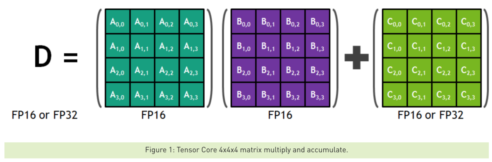
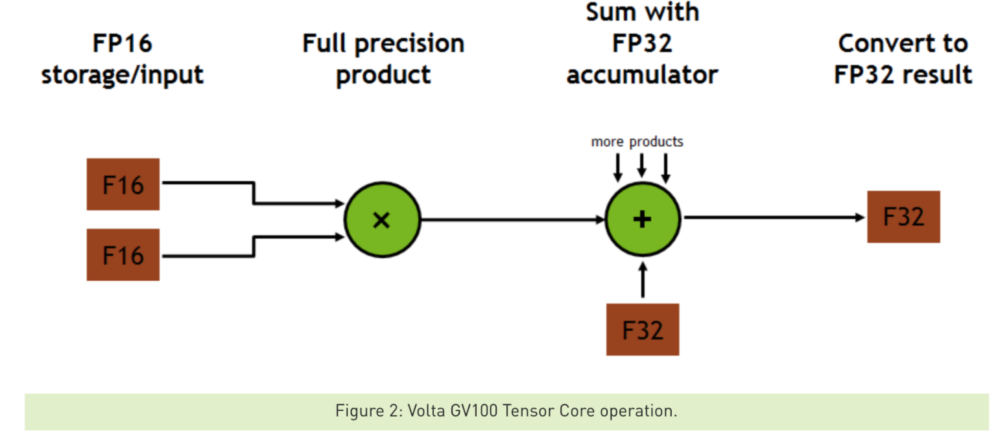

# Tensor cores

## Volta 

* the codename for a [GPU](https://en.m.wikipedia.org/wiki/Graphics_processing_unit) [microarchitecture](https://en.m.wikipedia.org/wiki/Microarchitecture) developed by [Nvidia](https://en.m.wikipedia.org/wiki/Nvidia), succeeding [Pascal](https://en.m.wikipedia.org/wiki/Pascal_(microarchitecture)). 
* first announced on a roadmap in March 2013.
* It was NVIDIA's first chip to feature <u>Tensor cores</u>, specially designed cores that have superior deep learning performance over regular CUDA cores.

---

[Programming Tensor Cores in CUDA 9](https://devblogs.nvidia.com/programming-tensor-cores-cuda-9/) [October 17, 2017 ]

## Programming Tensor Cores in CUDA 9.0

* Tensor Cores enable AI programmers to use [mixed-precision](https://developer.nvidia.com/automatic-mixed-precision) to achieve higher throughput without sacrificing accuracy.
* Tensor cores are programmable using NVIDIA libraries and directly in CUDA C++ code.

## What are Tensor Cores?

* Tesla V100’s Tensor Cores are programmable <u>matrix-multiply-and-accumulate</u> units that can deliver up to 125 Tensor TFLOPS for training and inference applications

* The Tesla V100 GPU contains 640 Tensor Cores: 8 per SM (Streaming Multiprocessor)

* Each Tensor Core provides a <u>4x4x4 matrix processing array</u> which performs the operation **D** = **A \* B + C**, where **A,** **B**, **C** and **D** are 4×4 matrices as Figure 1 shows. The matrix multiply inputs **A** and **B** are FP16 matrices, while the accumulation matrices **C** and **D** may be FP16 or FP32 matrices. **(so called mixed-precision/Mixed Precision Models)**

  

  

* Each Tensor Core performs 64 ($4^3$) <u>floating point FMA</u> (fused multiply-add) mixed-precision operations per clock $\Rightarrow$ 8 Tensor Cores in an SM perform a total of 1024 ($64 \times 2 \times 8$) <u>floating point operations</u> per clock
*  Multiple Tensor Cores are used concurrently by <u>a full warp of execution</u>, CUDA exposes <u>these larger 16x16x16 matrix operations</u> (provided by the threads within a warp) as warp-level matrix operations in the CUDA C++ WMMA API

## Tensor Cores in CUDA Libraries

* Two CUDA libraries that use Tensor Cores are cuBLAS and cuDNN

## [Optimizing For Tensor Cores](https://docs.nvidia.com/deeplearning/sdk/mixed-precision-training/index.html#opt-tensor-cores)

### 1. Satisfying Tensor Core <u>Shape Constraints</u>

| For **matrix multiplication**:                               | For **convolution**:                                         |
| ------------------------------------------------------------ | ------------------------------------------------------------ |
| On FP16 inputs, all three dimensions (M, N, K) must be multiples of 8. | On FP16 inputs, input and output channels must be multiples of 8. |
| On INT8 inputs (Turing only), all three dimensions must be multiples of 16. | On INT8 inputs (Turing only), input and output channels must be multiples of 16. |

In practice, for mixed precision training, our recommendations are:

1. Choose mini-batch to be a multiple of 8
2. Choose linear layer dimensions to be a multiple of 8
3. Choose convolution layer channel counts to be a multiple of 8
4. For classification problems, pad vocabulary to be a multiple of 8
5. For sequence problems, pad the sequence length to be a multiple of 8

### 2. Increasing Arithmetic Intensity

* **Defination**: Arithmetic intensity is a measure of how much computational work is to be performed in a kernel per input byte
* To increase arithmetic intensity in model :
  * Concatenate weights and gate activations in recurrent cells.
  * Concatenate activations across time in sequence models.
* To increase arithmetic intensity in model :
  * Prefer dense math operations.
    * For example, vanilla convolutions have much higher arithmetic intensity than depth-wise separable convolutions.
  * Prefer wider layers when possible accuracy-wise

### 3. Decreasing Non-Tensor Core Work

* Tensor Cores have no end-to-end speedups non-Tensor Core operations $\Rightarrow$ decrease the fraction of the non-Tensor core work
* It's also possible to speed up these operations by hand. $\Rightarrow$ some frameworks: <u>XLA for TensorFlow and the PyTorch JIT</u>

### 4. Mixed Precision Training 

* In order to make use of Tensor Cores, FP32 models will need to be converted to use a mix of FP32 and FP16. 
* This can be done either automatically using automatic mixed precision (AMP) [(detailed is introduced as bellow)](https://devblogs.nvidia.com/nvidia-automatic-mixed-precision-tensorflow/) or manually.

## [Automatic Mixed Precision for NVIDIA Tensor Core Architecture in TensorFlow](https://devblogs.nvidia.com/nvidia-automatic-mixed-precision-tensorflow/)

* Mixed-precision training uses <u>half-precision floating point</u> to speed up training, achieving <u>the same accuracy</u> as single-precision training sessions using the same hyper parameters. 
  * enables using Tensor Cores introduced in NVIDIA Volta and Turing GPU architectures
  * Mixed precision also reduces the memory footprint, enabling larger models or larger minibatches.

* Once enabling mixed precision, you can achieve further speedups by:
  * **Enabling the** **TensorFlow XLA compiler**.Please note that Google still lists XLA as an experimental tool
  * **Increasing the minibatch size.** Larger mini-batches often lead to better GPU utilization, mixed-precision enables up to 2x larger minibatches.

## [Deep Learning Performance Guide](https://docs.nvidia.com/deeplearning/sdk/dl-performance-guide/index.html)

* This guide describes and explains <u>the impact of parameter choice</u> on the performance of various types of neural network layers
* Performance Metric: operation speed, FLOPS

