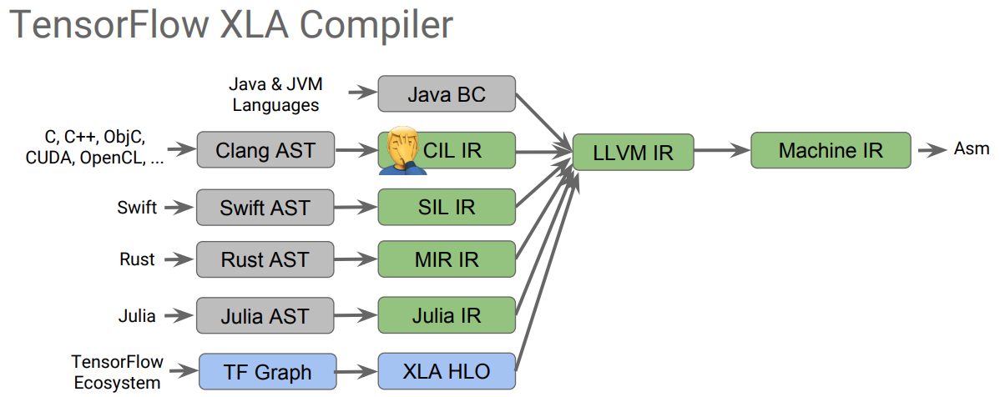
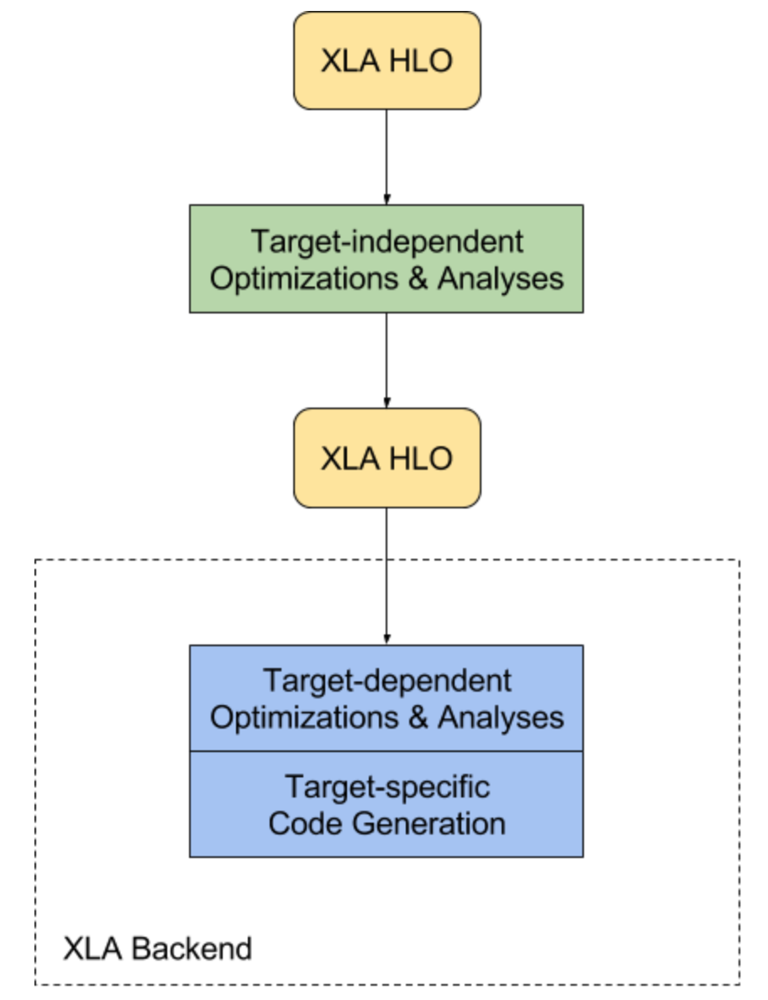

# XLA (Accelerated Linear Algebra)
## What is XLA
* XLA (Accelerated Linear Algebra) is a domain-specific compiler for linear algebra that optimizes TensorFlow computations

## Why to build XLA
* TensorFlow optimizes each operator separately
* *Improve execution speed.*
	* Compile subgraphs to reduce the execution time of short-lived Ops to eliminate overhead from the TensorFlow runtime, 
	* Fuse pipelined operations to reduce memory overhead, 
	* Specialize to known tensor shapes to allow for more aggressive constant propagation.
* *Improve memory usage.*
	* eliminate many intermediate storage buffers.
* *Reduce reliance on custom Ops.*
	* Remove the need for many custom Ops by improving the performance of automatically fused low-level Ops to match the performance of custom Ops that were fused by hand.
* *Reduce mobile footprint.*
	* Eliminate the TensorFlow runtime by ahead-of-time compiling the subgraph
	* Emitting an object/header file pair that can be linked directly into another application. (Emit efficient native machine code)
* *Improve portability.*
	* Make it relatively easy to write a new backend for novel hardware.

## Supported Platform
1. Support  JIT compilation on x86-64 and NVIDIA GPUs, use *JIT compilation* techniques to analyze the TensorFlow graph created by the user at runtime
	* JIT: just-in-time compiler — the JIT compiler compiles the byte code of that method into native machine code, compiling it “just in time” to run
2.  Support *ahead of time (AOT) compilation* for x86-64 and ARM

## Workflow
1. XLA takes graphs (“computations”) defined in HLO (High Level Optimizer, the input language),
2. _Target-independent_ optimization: operation fusion, and buffer analysis for allocating runtime memory for the computation
3. The backend performs further _target specific_ HLO-level optimization
4. Target-specific code generation

* The CPU and GPU backends included with XLA use LLVM for low-level IR, optimization, and code-generation
* For XLA, some benchmarks may experience slowdowns
* Most users will not see large benefits from XLA  [official Web](https://www.tensorflow.org/xla/overview) 
* The XLA framework is experimental and in active development.

