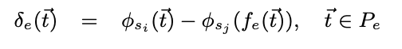
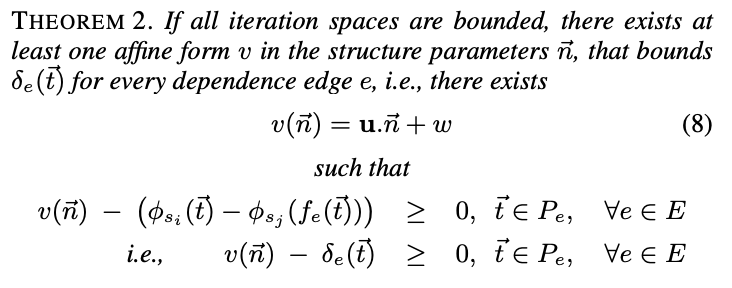
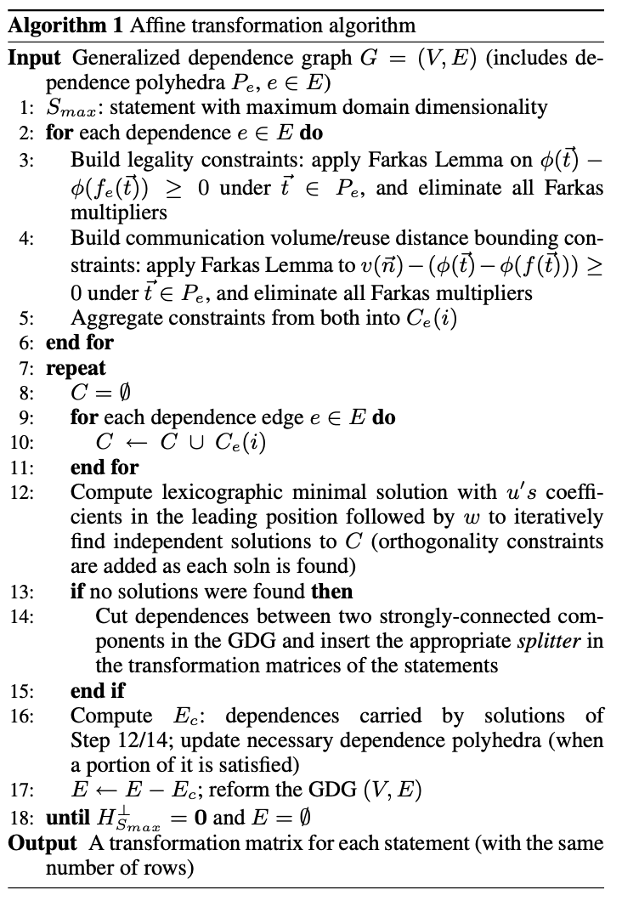

# A Practical and Fully Automatic Polyhedral Program Optimization System (2007/11/8)
#### Automatic parallelization, 3 steps

1. static dependence analysis of the input program (**advanced**)
2. transformations in the polyhedral abstraction (**Main Problem !!!**)
3. generation of efficient loop code for the transformed program (**advanced**)
   * **CLooG** [6, 1] is a powerful state-of-the-art code generator 

#### Related Work

Main Gap between Pluto and existing automatic transformation frameworks

* A significant problem is the lack of a realistic cost model 
* Many previously approaches do not consider <u>locality</u> and <u>parallelism</u>

This paper

* A practical parallelizer and locality optimizer in the polyhedral model

* Central idea: Finding good ways to tile for parallelism and locality directly in an **affine** transformation framework

tiling: parallelism

Fusion: locality, avoid cache missing

## Representation

* $\vec{i}$: iteration vector

* A polytope is a bounded polyhedron.

* A statement $S$ is associated with a <u>polytope</u> $ D_S$ of dimensionality $m_S$

#### Dependence Abstraction

* The Generalized Dependence Graph (GDG) is a <u>directed</u> multi-graph represented by
  the tuple (V , E, D, R)

  * V: statements, e.g., $S_i, S_j \in V$
  * E: edges representing dependence (directed), e.g., $e \in E$
  * D: a function from V to corresponding polytope
  * R: a function from E to the corresponding dependence relations, e.g., $R_e$

* Source $S_i : \ \vec{s}$ , Target $S_j : \vec{t}$, we have $ \vec{s} \in D^{S_i},  \vec{t} \in D^{S_j}, \langle \vec{s}, \vec{t} \rangle \in R_e$

#### Cost Function

* $\delta_e(\vec{t})$ : 1) a measure of the reuse distance if the hyperplane is used as time (sequentially); 2) a factor in the communication volume,
* if this function can be reduced to a **constant** amount or **zero** by choosing a suitable direction for $\phi$, that particular dependence leads to a constant or no communication for this hyperplane

#### Cost function bounding and minimization

* Since  $\delta_e(\vec{t})$ involves in both  loop variables and hyperplane coefficients, bound it to elimate loop variables

* Minimize the bound

  

* finding a <u>lexicographic minimal solution</u> with $\vec u$ and $w$ in the leading position, and the other variables following in any order, using the ***Parametric Integer Programming (PIP)*** software. 
  
* Let $ \vec u = (u_1, u_2, . . . u_k) $.
$$
minimize_≺ \{u_1, u_2, . . . , u_k, w, . . . , c_i^\prime s, . . . \}
$$

#### Iteratively finding independent solutions through orthogonal basis.
> Once a solution is found, we augment the ILP formulation with new constraints and obtain the next solution; the new constraints make sure of linear independence with solutions already found, by
> constructing the orthogonal sub-space of the transformation rows found so far ($H_S$) as follows:

$$
H_S^⊥ = I − H_S^T (H_S H_S^T)^{-1} H_S
$$

## What's PIP/PipLib?

PIP/PipLib is the well known Paul Feautrier's parametric integer linear programming solver. PIP is a software that finds the <u>lexicographic minimum (or maximum)</u> in the set of integer points belonging to a convex polyhedron. 

