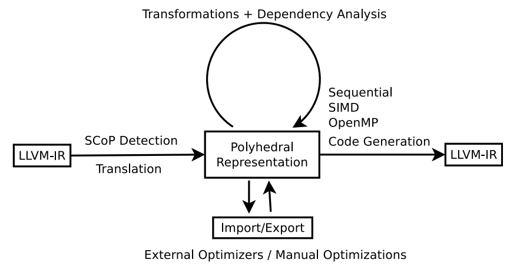

# Polly - Polyhedral optimization in LLVM

*  January 2011

## Motivation

* Most polyhedral tools are limited to a specific programming language $\Rightarrow$ programming-language-specific techniques (like Java or Haskell.)
* Even for this language, relevant code needs to match <u>specific syntax</u> that rarely appears in existing code. (disallowing any pointer arithmetic or higher level language constructs like C++ iterators )
* May apply incorrect transformations, e.g., implicit type casts, integer wrapping or aliasing in C are mostly ignored

## What is Polly

* A project to enable polyhedral optimizations in LLVM

* automatically detects and transforms relevant program parts in a <u>language-independent</u>
  and <u>syntactically transparent</u> way 

  $\Rightarrow$ supports programs written in most common programming languages (not only for  C/C++ ) and constructs 
  
* provides a state-of-the-art polyhedral library with full support for **Z-polyhedra**, <u>advanced data dependency analysis and support for external optimizers.</u>

* Polly includes integrated SIMD and OpenMP <u>code generation</u>

* Through LLVM, machine code for CPUs and GPU accelerators, C source code and even hardware descriptions can be targeted

  

## Related Work

### Low-level virtual machine (LLVM)

* a set of tools and libraries to build a compiler
* Based on a language and <u>platform-independent</u> intermediate representation (IR)
* provides 1) state-of-the-art analyses, 2) optimizations and 3) target code generation
* LLVM-IR is a very low-level representation of a program, which 
  * does **not** have loops, and has **no** arrays or affine expressions, 
  * Has jumps and gotos  but pointer arithmetic and three address form operations.
* Optimizations that transform <u>multiplications</u> into <u>shifts</u> or a sequence of <u>additions</u> are very common
* understanding the effects of calculations on LLVM-IR is difficult  $\Rightarrow$   LLVM provides an analysis called scalar evolution, which calculates closed form expressions for all scalar integer variables in a program

## Details

* Polly accepts LLVM-IR as input and take LLVM-IR as output, 

  * $\Rightarrow$  it is programming language independent and transparently supports constructs 
    * like C++ iterators, pointer arithmetic or goto based loops
  * Front end: translates from LLVM-IR into a <u>polyhedral representation</u>
  * Middle end: transforms and optimizes this representation
  * Back end: translates it back to LLVM-IR

  

### LLVM-IR to Polyhedral Model

1. Region-based SCoP detection
   * static control parts (SCoPs), the classical domain of polyhedral optimizations
   * A *<u>region</u>* is a subgraph of the control flow graph (CFG) that is connected to the remaining graph by only two edges, an entry edge and an exit edge.
   * A <u>*canonical region*</u> is a region that cannot be constructed by merging two adjacent smaller regions.
   * Target: find the maximal non-canonical regions that form valid SCoPs.
2. Semantic SCoPs
   * arbitrary control flow structures are valid (has the semantics of a SCoP) if they can be written as a well-structured set of for-loops and if-conditions with <u>affine expressions</u> in lower and upper bounds and in the operands of the comparisons
   * **Assumption of Polly ???**

### Polyhedral Model

1. The integer set library
2. Composable polyhedral transformations
   * Polly uses the classical polyhedral description that describes a SCoP as a set of statements each defined by 
     1. domain: the set of values the induction variables surrounding the statement enumerate. 
     2. schedule: a relation which, when applied to the domain, yields the execution times of the statement’s operations (not affine functions) $\Rightarrow$the composition of transformations is simply the composition of the relations/schedule representing the schedules, no modifications of the domain
     3. a set of memory accesses.
3. Export/Import

### Polyhedral Model to LLVM-IR

* uses **CLooG** , polyhedral representation $\Rightarrow$ a generic AST $\Rightarrow$ LLVM-IR
1. Detecting parallel loops
	* detects parallelism **after** generating the generic AST
	* for each generated for-loop, calculates if it can be executed in parallel 
2. Trivially SIMDizable loops
   * A trivially SIMDizable loop is a loop that is 1) parallel, 2)does not have any control flow statements in its body and 3) has a number of iterations that is in the order of magnitude of the SIMD vector width
   * find such a loop on the generic AST, instead of translated to loop structrue, to a **set of vector instructions** with a width corresponding to the number of loop iterations.
   * introduce SIMD vector code