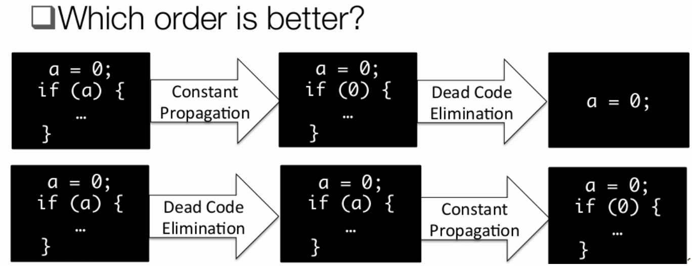
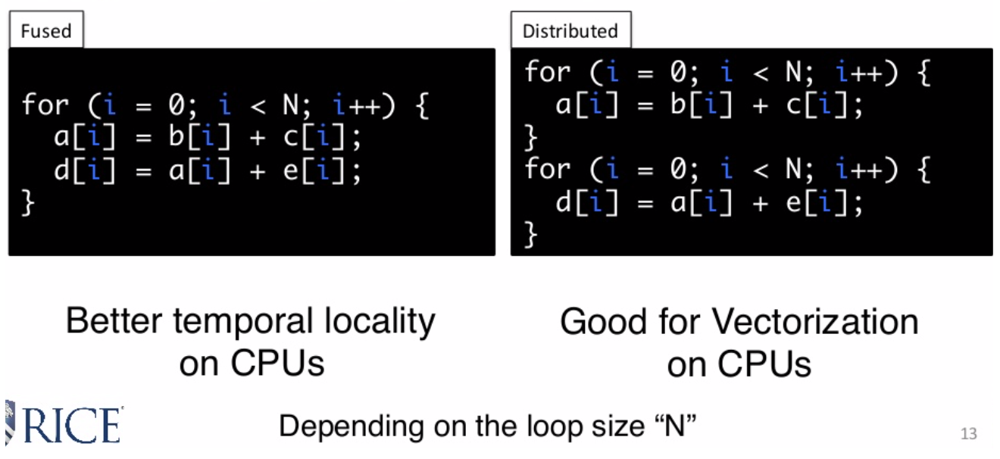
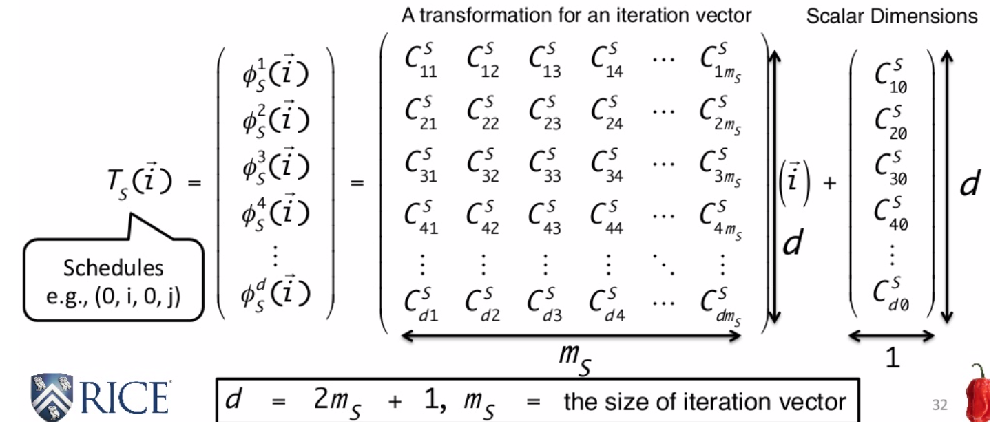
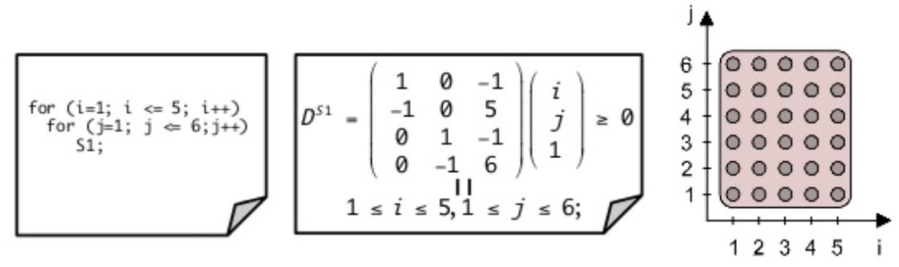
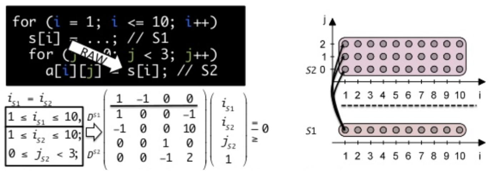

# Polyhedral model

## What is Polyhedral model?

The polyhedral model is a <u>compilation technique</u> which 
* treats each loop iteration within nested loops as [lattice points](https://en.wikipedia.org/wiki/Lattice_points) inside mathematical objects called [polyhedra](https://en.wikipedia.org/wiki/Polytope) 
* performs [affine transformations](https://en.wikipedia.org/wiki/Affine_transformation) or more general non-affine transformations such as [tiling](https://en.wikipedia.org/wiki/Loop_tiling) on the polytopes
* converts the transformed polytopes into equivalent, but optimized (depending on targeted optimization goal), loop nests through polyhedra scanning.

* Nested loop programs are the typical, but not the only example, and the most common use of the model is for [loop nest optimization](https://en.wikipedia.org/wiki/Loop_nest_optimization) in [program optimization](https://en.wikipedia.org/wiki/Program_optimization) 


[Introduction to Polyhedral Compilation](https://www.slideshare.net/ahayashi10/introduction-to-polyhedral-compilation)

## Why Polyhedral Model
> The Polyhedral Model is a convenient alternative representation which combines analysis power, expressiveness and high flexibility” - OpenScop Specification and Library

* In contrast to Abstract Syntax Tree 
* One solution for tackling the phase-ordering problem
	
* Good for performing a set of loop transformations 
	* Loop permutation (interchange) : stride access or offset access
	* Loop fusion/distribution: 
	
	* Loop tiling


## Schedules


* $d = 2 m_s + 1, m_s = $ the size of iteration vector
* $s$ denotes a statement, $\vec{i} $ denotes the iteration vector
* Function $T$: return the logical state of each statement

#### An Example: Loop permutation

* Original schedule: $T_{S_1}(i, j) = (i, j)$

```c++
for (i = 0; i < 2; i++) {
	for (j = 0; j < 3; j++){
    b[i][j] = ...; // S1
  }
}
```

* New schedule: $T_{S_1}(i, j) = \begin{pmatrix} 0 & 1 \\ 1 & 0  \end{pmatrix}  \begin{pmatrix} i \\ j \end{pmatrix} =   \begin{pmatrix} j \\ i  \end{pmatrix} $ , where $\begin{pmatrix} 0 & 1 \\ 1 & 0  \end{pmatrix}$ is the <u>transformation</u>

```c++
for (j = 0; j < 3; j++) {
	for (i = 0; i < 2; i++){
    b[i][j] = ...; // S1
  }
}
```


## 3 important things

- Domain: a set of instances for a statement
- Scattering (Scheduling): an instance -> time stamp (function $T$)
- Access: an instance -> array elements

## Limitation

- Only applicable for Static Control Part (SCoP) in general 
  -> Loop bounds and conditions are affine function of the surroundings the loop iterators.

## Iteration Domain



* A set of constraints to represent instances of a statement
  * Using iteration vectors (i, j);
  * <u>If those constraints are affine -> Polyhedron (limitation)</u>

## Legality

* Dependence polyhedron example

  

* Dependence polyhedron: $P_e$, a set of inequalities ($i_{S_1} = i_{S_2} \Rightarrow i_{S_1} - i_{S_2} \geq 0 \and i_{S_2} - i_{S_1} \geq 0$)

  * A general and accurate representation of instance-wise dependences.

* Legality:

  * $\forall \langle s, t \rangle \in P_e, (s \in D^{S_i}, t \in D^{S_j}), T_{S_i}(s) \prec T_{S_j}(t)$
  * If "source" instance must happen before "target" instance in the original program, the transformed program must preserve this property (must satisfy the dependence)