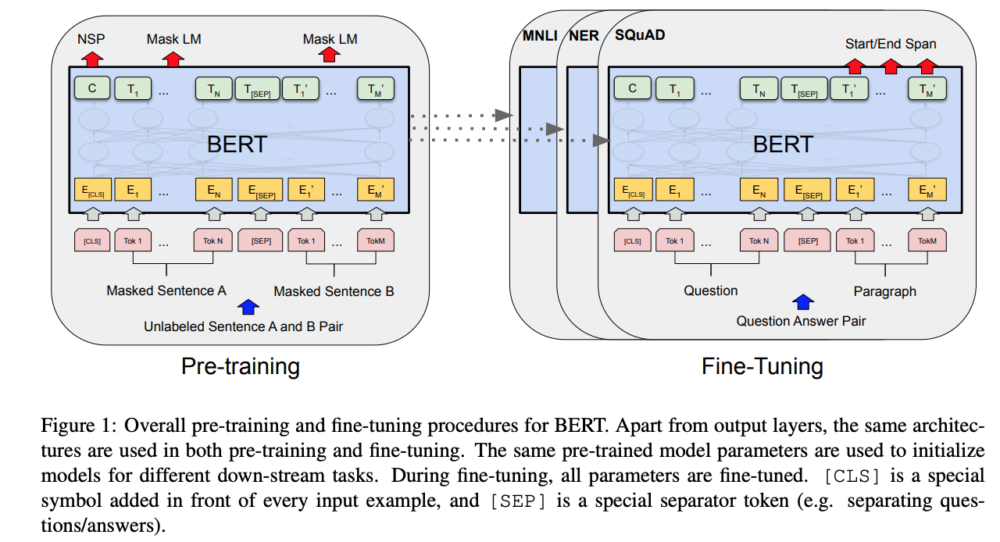
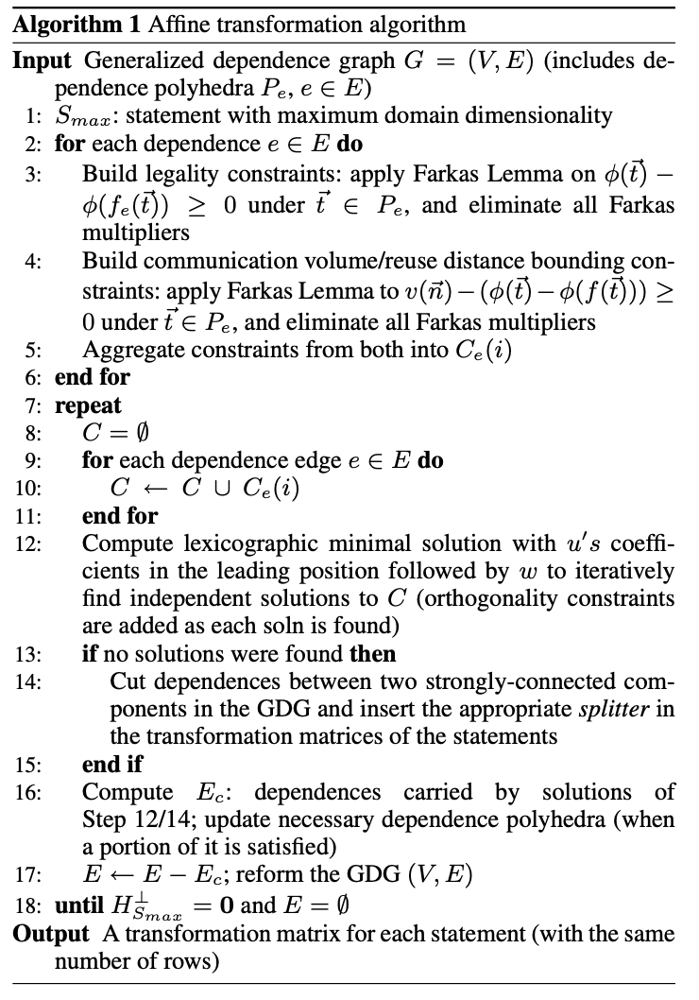

# The OoO VLIW JIT Compiler for GPU Inference

- This paper is too high level.

## Motivation

- Deep learning inference needs to scale to billions of queries per day (Amazon estimates that 90% of production ML infrastructure costs are from inference, not training)
- To achieve tight latency objective for **interactive inference (online) **, GPU is required, resulting in **poor GPU utilization**. In contrast,
  - Offline iterative minibatch <u>training</u> can achieve high level of parallelism
  - <u>Batch inference</u> queries have no strict latency deadline and are primarily concerned with maximizing throughput. System designers aim to optimize the *cost-per-query* for batch inference

## An Emergeing Utilization Gap

- <u>Throughput-optimized inference accelerators (e.g., GPU, TPU)</u> see low utilization when serving interactive DNN workloads

#### Factors of the Gap

- Tight latency objectives limit abailable parallelism
  - low latency demand -> small batch size -> low arithmetic intensity -> insufficient parallelism
- Resources must be provisioned for peak demand, in case of <u>occasional bursts in request volume</u>
- growth in compute throughput outpaces memory bandwidth. (online inference demands large memory bandwidth)

## Proposed Solution

- An *Out-of-Order (OoO) Just-in-Time (JIT)* GPU kernel *VLIW*-inspired compiler for DNN inference

#### Details

- *late-binding* and *context-aware* dynamic resource allocation:
  - leverage runtime information about the number of concurrent kernels of execution, and device context (e.g., the typical problem sizes served by a device). 
  - In contrast to tradional *early-binding* approach (e.g., CUDA API), where users need to specify the dimensionality and shape of the program without any contextual information on the available GPU resources or other kernel of execution that may be in flight.
  - Given this information, individual kernels can be
    - Retuned for better **spatial multiplexing ???**
    - Coalesced for better utilization
    - Reordered for better spatiotemporal packing
- OoO Execution for SLO Attainment
  - monitoring inference latencies per-kernel
  - Reallocate resources between tenants on-the-fly
  - In contrast to static compilers, e.g., TensorRT...
  - A dynamic JIT compiler <u>overlaps</u> waiting time from caolescing with computation from other execution streams.

- VLIW Compilation for Efficiency **???**
  - Retune superkernel ahead-of-time -> improve **co-tenancy ???**
  - Auto-tune other parameters of GPU pragrams
  - At runtime,  the VLIW JIT compiler repacks multiple small kernels into a large execution block. The compiler can apply pre-computed parameters from the auto-tuning phase to further optimize these larger kernel conigurations. 

## VLIW compilers

- Extract *instruction level parallelism* (ILP)
- Packet multiple <u>mutually-independent</u> instructions that utilize <u>diferent arithmetic processing units</u> into a single large instruction word. 
- Modify programs ahead-of-time

# BERT: Pre-training of Deep Bidirectional Transformers for Language Understanding

- led by Google AI

https://arxiv.org/pdf/1810.04805.pdf

## Motivation

- Language model pre-training has been shown to be effective for improving many *natural language processing (NLP)* tasks
- two existing strategies for applying pre-trained language representations to downstream tasks
  1. *feature-based*: uses task-specific architectures that include the pre-trained representations as additional features. (ELMo)
  2. *fine-tuning*: introduces minimal task-specific parameters, and is trained on the downstream tasks by simply fine-tuning all pretrained parameters (the Generative Pre-trained Transformer, OpenAI
     GPT)

#### Gap

- The major limitation of previous work is that standard language models are unidirectional
- limits the choice of architectures that can be used during pre-training

## What 

- **B**idirectional **E**ncoder **R**epresentations from **T**ransformers
- The fine-tuning based approaches
- **bidirectional** pre-training for language representation
- alleviates the previously mentioned unidirectionality constraint by using a “*masked language model” (MLM)* pre-training objective

#### 1. Pre-training

- The model is trained on <u>unlabeled data</u> over <u>different pre-training tasks</u>.
- **Masked LM （MLM) **：
  - mask some percentage of the input tokens at random, and then predict those masked tokens
  - mask 15% of all WordPiece tokens in each sequence at random (with [MASK] token 80% of the time; random token 10%; unchanged 10%)
- **Next Sentence Prediction (NSP)**:
  - such as Question Answering (QA) and Natural Language Inference (NLI)
  - understanding the relationship between two sentences (between A and B)
  - 50% of the time B is the actual next sentence that follows A (labeled as IsNext), and 50% of the time it is a random sentence from the corpus (labeled as NotNext).

#### 2. Fine-tuning

- The BERT model is first initialized with the pre-trained parameters, and all of the parameters are fine-tuned using labeled data from the downstream tasks. 
- Each downstream task has separate fine-tuned models, even though they are initialized with the same pre-trained parameters
- Compared to pre-training, fine-tuning is relatively inexpensive. 
  - at most 1 hour on a single Cloud TPU, 
  - or a few hours on a GPU

#### Model Architecture

- Unified architecture across different tasks, <u>minimal difference</u> between the pre-trained architecture and the final downstream architecture (output layers)
- Two model sizes: 
  - $BERT_{BASE}$ (L=12, H=768, A=12, Total Parameters=110M), the same model size as OpenAI GPT
  - $BERT_{LARGE}$ (L=24, H=1024, A=16, Total Parameters=340M).
  - $A$: the number of self-attention heads  **???**

# A Practical and Fully Automatic Polyhedral Program Optimization System (2007/11/8)

#### Automatic parallelization, 3 steps

1. static dependence analysis of the input program (**advanced**)
2. transformations in the polyhedral abstraction (**Main Problem !!!**)
3. generation of efficient loop code for the transformed program (**advanced**)
   - **CLooG** [6, 1] is a powerful state-of-the-art code generator 

#### Related Work

Main Gap between Pluto and existing automatic transformation frameworks

- A significant problem is the lack of a realistic cost model 
- Many previously approaches do not consider <u>locality</u> and <u>parallelism</u>

This paper

- A practical parallelizer and locality optimizer in the polyhedral model
- Central idea: Finding good ways to tile for parallelism and locality directly in an **affine** transformation framework

tiling: parallelism

Fusion: locality, avoid cache missing

## Representation

- $\vec{i}$: iteration vector
- A polytope is a bounded polyhedron.
- A statement $S$ is associated with a <u>polytope</u> $ D_S$ of dimensionality $m_S$

#### Dependence Abstraction

- The Generalized Dependence Graph (GDG) is a <u>directed</u> multi-graph represented by
  the tuple (V , E, D, R)
  - V: statements, e.g., $S_i, S_j \in V$
  - E: edges representing dependence (directed), e.g., $e \in E$
  - D: a function from V to corresponding polytope
  - R: a function from E to the corresponding dependence relations, e.g., $R_e$
- Source $S_i : \ \vec{s}$ , Target $S_j : \vec{t}$, we have $ \vec{s} \in D^{S_i},  \vec{t} \in D^{S_j}, \langle \vec{s}, \vec{t} \rangle \in R_e$

#### Cost Function

- $\delta_e(\vec{t})$ : 1) a measure of the reuse distance if the hyperplane is used as time (sequentially); 2) a factor in the communication volume,
- if this function can be reduced to a **constant** amount or **zero** by choosing a suitable direction for $\phi$, that particular dependence leads to a constant or no communication for this hyperplane

#### Cost function bounding and minimization

- Since  $\delta_e(\vec{t})$ involves in both  loop variables and hyperplane coefficients, bound it to elimate loop variables

- Minimize the bound

  

- finding a <u>lexicographic minimal solution</u> with $\vec u$ and $w$ in the leading position, and the other variables following in any order, using the ***Parametric Integer Programming (PIP)*** software. 

- Let $ \vec u = (u_1, u_2, . . . u_k) $.

$$
minimize_≺ \{u_1, u_2, . . . , u_k, w, . . . , c_i^\prime s, . . . \}
$$

#### Iteratively finding independent solutions through orthogonal basis.

> Once a solution is found, we augment the ILP formulation with new constraints and obtain the next solution; the new constraints make sure of linear independence with solutions already found, by
> constructing the orthogonal sub-space of the transformation rows found so far ($H_S$) as follows:

$$
H_S^⊥ = I − H_S^T (H_S H_S^T)^{-1} H_S
$$

## What's PIP/PipLib?

PIP/PipLib is the well known Paul Feautrier's parametric integer linear programming solver. PIP is a software that finds the <u>lexicographic minimum (or maximum)</u> in the set of integer points belonging to a convex polyhedron. 

