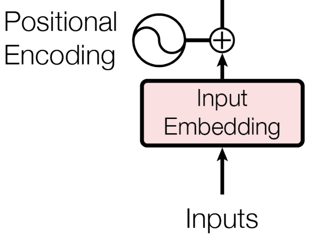
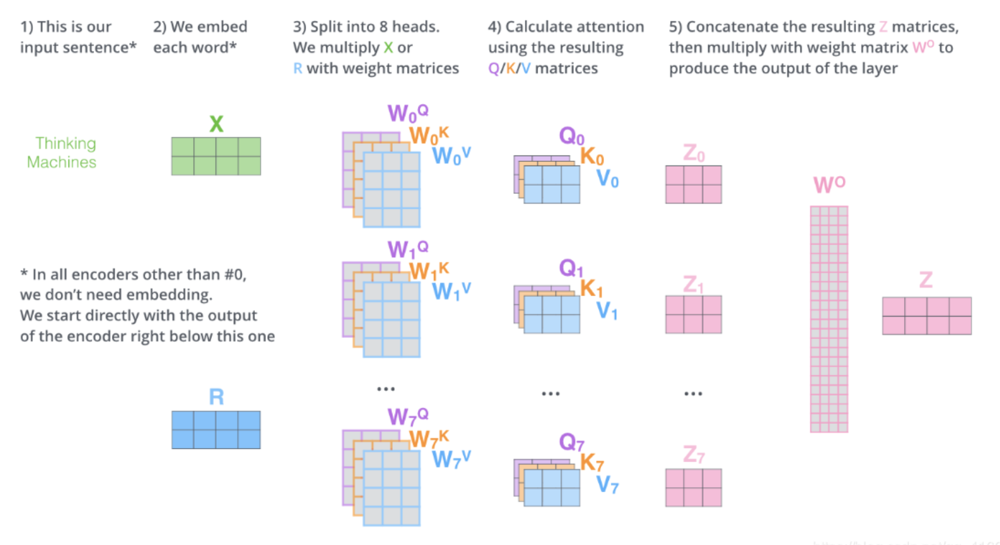

# BERT: Pre-training of Deep Bidirectional Transformers for Language Understanding

* led by Google AI

https://arxiv.org/pdf/1810.04805.pdf

## Motivation

* Language model pre-training has been shown to be effective for improving many *natural language processing (NLP)* tasks
* two existing strategies for applying pre-trained language representations to downstream tasks
  1. *feature-based*: uses task-specific architectures that include the pre-trained representations as additional features. (ELMo)
  2. *fine-tuning*: introduces minimal task-specific parameters, and is trained on the downstream tasks by simply fine-tuning all pretrained parameters (the Generative Pre-trained Transformer, OpenAI
     GPT)

#### Gap

* The major limitation of previous work is that standard language models are unidirectional
* limits the choice of architectures that can be used during pre-training

## What 

* **B**idirectional **E**ncoder **R**epresentations from **T**ransformers

* The fine-tuning based approaches

* **bidirectional** pre-training for language representation

* alleviates the previously mentioned unidirectionality constraint by using a “*masked language model” (MLM)* pre-training objective

#### 1. Pre-training

* The model is trained on <u>unlabeled data</u> over <u>different pre-training tasks</u>.
* **Masked LM （MLM) **：
  * mask some percentage of the input tokens at random, and then predict those masked tokens
  * mask 15% of all WordPiece tokens in each sequence at random (with [MASK] token 80% of the time; random token 10%; unchanged 10%)
* **Next Sentence Prediction (NSP)**:
  * such as Question Answering (QA) and Natural Language Inference (NLI)
  * understanding the relationship between two sentences (between A and B)
  * 50% of the time B is the actual next sentence that follows A (labeled as IsNext), and 50% of the time it is a random sentence from the corpus (labeled as NotNext).

#### 2. Fine-tuning

* The BERT model is first initialized with the pre-trained parameters, and all of the parameters are fine-tuned using labeled data from the downstream tasks. 
* Each downstream task has separate fine-tuned models, even though they are initialized with the same pre-trained parameters
* Compared to pre-training, fine-tuning is relatively inexpensive. 
  * at most 1 hour on a single Cloud TPU, 
  * or a few hours on a GPU

#### Model Architecture

* Unified architecture across different tasks, <u>minimal difference</u> between the pre-trained architecture and the final downstream architecture (output layers)
* Two model sizes: 
  * $BERT_{BASE}$ (L=12, H=768, A=12, Total Parameters=110M), the same model size as OpenAI GPT
  * $BERT_{LARGE}$ (L=24, H=1024, A=16, Total Parameters=340M).
  * $A$: the number of self-attention heads  **???**

# Transformer - Attention Is All You Need

* Google Brain, 2017 NIPS

## What is Attention/Self-attention

* Self-attention, sometimes called intra-attention is an attention mechanism relating different positions of a single sequence in order to compute a representation of the sequence

* Transformer is the **first** transduction model relying <u>entirely on self-attention</u> to compute representations of its input and output without using sequence-aligned RNNs or convolution

## Encoder

- The left half is the encoder, consisting of $N \times $ layers, each has two sub-layers.

* Inputs $\vec{x} \in \mathbb{R}^{n \times d_{model}}$
* **Positional Ecoding**: 
  * Since no recurrence and no convolution, in order for the model to make use of the
    order of the sequence, inject some information about the relative or absolute position of the tokens in the sequence. 
  * The positional encodings have the same dimension $d_{model}$ as the embeddings, so that the two can be summed
  * For each dimension $i \in [0, d_{model})$, 
  * $PE(pos,2i) = sin(pos/100002i/dmodel)$
  * $PE(pos,2i+1) = cos(pos/100002i/dmodel)$
* After position ecoding, input embedding $\vec{x} \in \mathbb{R}^{n \times d_{model}}$

Three abstract vectors:

* Query vector: $Q = \vec x \cdot W^Q \in \mathbb{R}^{n \times d_k}$, $W^Q \in \mathbb{R}^{d_{model} \times d_k}$

* Key vector: $K = \vec x \cdot W^K \in \mathbb{R}^{n \times d_k}$, $W^K \in \mathbb{R}^{d_{model} \times d_k}$

* Value vector: $V = \vec x \cdot W^V \in \mathbb{R}^{n \times d_v}$, $W^V \in \mathbb{R}^{d_{model} \times d_v}$

#### Multi-Head Attention in Detail

* $Attention(Q, K, V) = softmax(\frac{QK^T}{\sqrt{d_k}}) \cdot V \in \mathbb{R}^{n \times d_v}$ 

* In each row of $softmax(\frac{QK^T}{\sqrt{d_k}}) \in \mathbb{R}^{n \times n}$,  e.g. $i_{th}$ row, the $j_{th}$ element denotes the correlation between $i_{th}$ word and $j_{th}$ word, than be multiplied to corresponding values.
* Scale: We suspect that for large values of $d_k$, the dot products grow large in magnitude, pushing the softmax function into regions where it has **extremely small gradients**. To counteract this effect, we scale the dot products by $\frac{1}{\sqrt{d_k}}$.

* $MultiHead(Q, K, V) = Concat(head_1, head_2, …, head_h) \cdot W^O \in \mathbb{R}^{n \times d_{model}}$, where $W^O \in \mathbb{R}^{hd_v \times d_{model}}$ (used as the Linear function)

#### Connection between two sub-layers: Add-Norm

* <u>A residual connection</u>  around each of the two sub-layers, followed by layer normalization. That is, the output of each sub-layer is $LayerNorm(x + Sublayer(x)) \in \mathbb{R}^{n \times d_{model}}$
* The output of the second sub-layer/ecoder layer: $\vec z \in \mathbb{R}^{n \times d_{model}}$

[图解Transformer](https://blog.csdn.net/qq_41664845/article/details/84969266)

* Illustration of Encoder workflow

## Decoder

* $K, V$ from encoders are fed into <u>each encoder in encoders</u>.
* Output shift right as next "input" of decoders: I am -> I am a -> I am a student
  * Sequence-to-sequence model

## Why Self-Attention

1. The total computational complexity per layer. 
2. The amount of computation that can be parallelized, as measured by the minimum number of sequential operations required.
3. The path length between long-range dependencies in the network